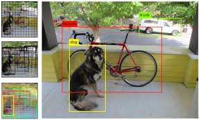
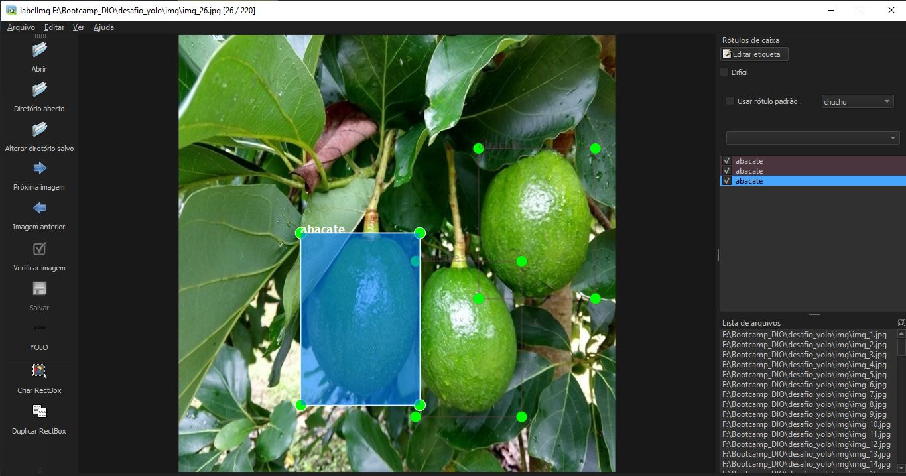
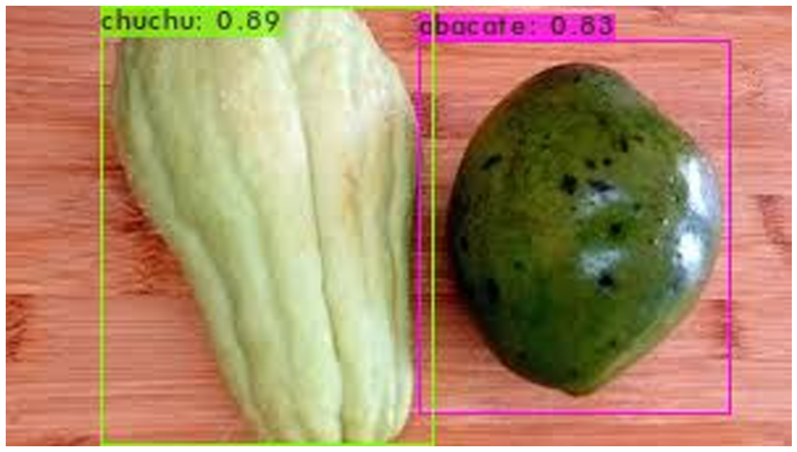
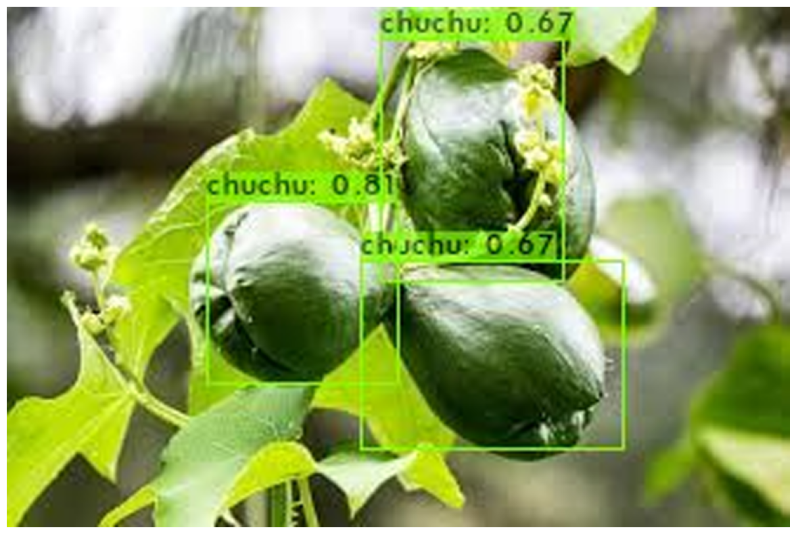
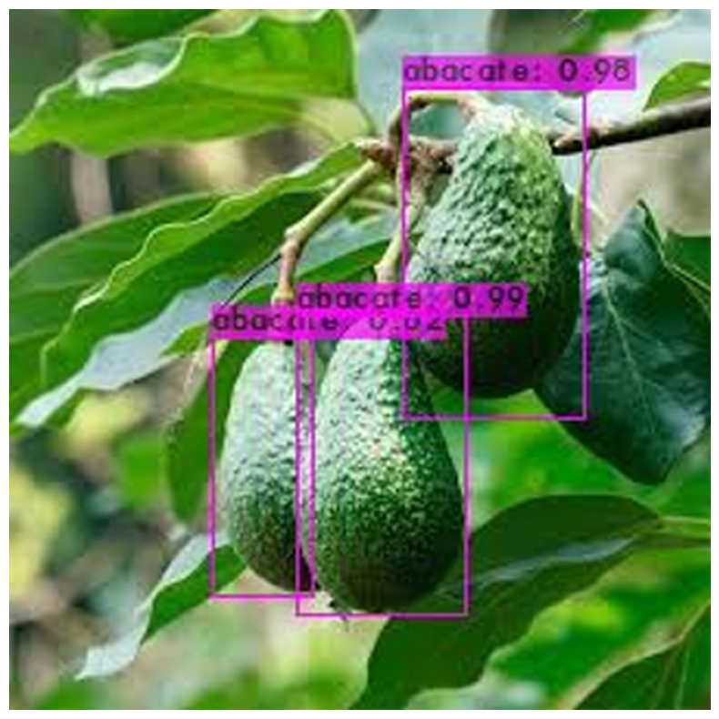

# Projeto de criação de uma base de dados e treinamento da rede YOLOv4.
O trabalho deve conter pelo menos duas classes retreinadas para detecção, além das classes já treinadas previamente antes de realizar o transfer learning.

Por meio da imagem é possível visualizar um exemplo de resultado esperado:

## Descrição
Este desafio consiste em adicionar mais duas classes a uma rede [YOLOv4](https://docs.ultralytics.com/pt/models/yolov4/#what-are-bag-of-freebies-in-the-context-of-yolov4) previamente treinada. As classes escolhidas são "abacate" e "chuchu".

## Conjunto de Dados
Utilizamos um pequeno conjunto de imagens contendo 100 fotos. Todas as imagens foram rotuladas utilizando a ferramenta [LabelImg](https://github.com/tzutalin/labelImg).

## Ferramentas Utilizadas
- [YOLOv4](https://docs.ultralytics.com/pt/models/yolov4/#what-are-bag-of-freebies-in-the-context-of-yolov4)
- [LabelImg](https://github.com/tzutalin/labelImg)

## Passos para Reproduzir
1. **Preparação do Ambiente**:
    - Instale as dependências necessárias.
    - Configure o ambiente para treinar a rede [YOLOv4](https://docs.ultralytics.com/pt/models/yolov4/#what-are-bag-of-freebies-in-the-context-of-yolov4).

2. **Rotulação das Imagens**:
    - Utilize o [LabelImg](https://github.com/tzutalin/labelImg) para rotular as imagens com as novas classes "abacate" e "chuchu".

    

3. **Treinamento da Rede**:
    - Adicione as novas classes ao arquivo de configuração da [YOLOv4](https://docs.ultralytics.com/pt/models/yolov4/#what-are-bag-of-freebies-in-the-context-of-yolov4).
    - Treine a rede utilizando o conjunto de dados rotulado.

4. **Avaliação**:
    - Avalie a performance da rede com as novas classes.
    - Ajuste os hiperparâmetros conforme necessário para melhorar a precisão.

## Resultados
- No primeiro teste foi usado uma imagem contendo um elemento de cada classe, a rede não foi capaz de identificar corretamente o abacate, podeos ver que existe ua caixa de cada classe.

- Na segunda imagen de teste o resultado já foi melhor, as caixas delimitadoras ainda não esta cobrindo todo o chuchu, mas, por ter treinado apenas 900 épocas o resultado não esta ruim.

- Treceira imagem de teste, imagem apenas com abacates que foram bem detectados pela rede.

## Conclusão
- Resuma as principais conclusões do desafio.
- Sugira possíveis melhorias ou próximos passos.

## Referências
- [YOLOv4 Paper](https://arxiv.org/abs/2004.10934)
- [LabelImg GitHub](https://github.com/tzutalin/labelImg)
