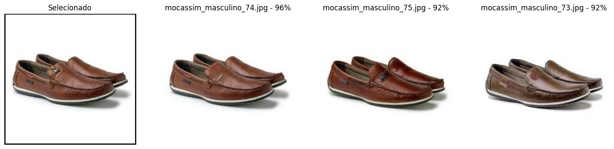

# Projeto: Recomendação de Produtos por Similaridade de Imagens

## Visão Geral do Projeto
Este projeto tem como objetivo criar um sistema capaz de recomendar produtos similares com base em imagens. O sistema foi projetado para processar imagens de diferentes categorias de produtos `mocassim masculino, relógio feminino, relógio masculino e scarpin` e identificar itens visualmente semelhantes.

Com base no modelo **MobileNetV2**, que foi previamente treinado com o banco de dados ImageNet, o projeto utiliza Transfer Learning para adaptar o modelo ao conjunto de dados específico. A abordagem permite extrair características detalhadas das imagens e calcular a similaridade entre produtos usando a métrica de similaridade de cosseno.

## Estrutura do Projeto

A estrutura do projeto é organizada da seguinte forma:

- `carregar.py`: Carrega e prepara oa dados já organizados em pastas de terino, teste e validação.
- `chamadas.py`: Contém funções para configurar callbacks do treinamento.
- `constantes.py`: Define constantes usadas no projeto, como caminhos de pastas e parâmetros de treinamento.
- `graficos.py`: Funções para exibir gráficos e espaçadores.
- `main.py`: Script principal para carregar dados, treinar o modelo e avaliar o desempenho.
- `modelo.py`: Define a arquitetura do modelo MobileNetV2 e funções para compilar e treinar o modelo.
- `recomendacao.py`: Funções para extrair características de imagens, calcular similaridade e recomendar produtos.
- `rodar_script_main.ipynb`: Notebook Jupyter para experimentação e visualização dos resultados.

## Dependências

As principais bibliotecas utilizadas no projeto são:

- `tensorflow`: Para construção e treinamento do modelo de rede neural.
- `numpy`: Para operações numéricas.
- `PIL`: Para manipulação de imagens.
- `sklearn`: Para cálculo da similaridade do cosseno.
- `matplotlib`: Para visualização de gráficos.

## Organização do Sistema
O sistema está organizado em várias etapas:

1. **Preparação do Conjunto de Dados**
   As imagens foram organizadas em pastas correspondentes às suas categorias: treino, validação e teste. Cada imagem foi redimensionada para um tamanho fixo de 224x224 pixels para ser compatível com o modelo MobileNetV2. Os dados foram normalizados para o intervalo de [-1, 1], dividindo os valores RGB por 127.5 e subtraindo 1, facilitando o processamento pelo modelo.

2. **Transfer Learning**
   A base do MobileNetV2 foi congelada para reter as características aprendidas no treinamento com o ImageNet. Foram adicionadas camadas densas personalizadas ao topo da rede para adaptar o modelo ao conjunto de dados. A arquitetura MobileNetV2 utiliza convoluções separáveis em profundidade para reduzir a complexidade computacional, mantendo alta precisão.

3. **Treinamento do Modelo**
   O modelo foi treinado utilizando callbacks como Early Stopping, ModelCheckpoint e Redução do Learning Rate. A taxa de aprendizado foi ajustada dinamicamente durante o treinamento, com o uso de um scheduler para reduzir o learning rate quando o desempenho no conjunto de validação não melhorava. As métricas de desempenho incluem a perda (Loss) e a acurácia, monitoradas para os conjuntos de treino e validação.

4. **Geração de Embeddings**
   As características das imagens foram extraídas utilizando o modelo treinado para gerar embeddings. Esses embeddings representam um vetor de características da imagem.

5. **Recomendações Baseadas em Similaridade**
   As características foram extraídas das imagens utilizando o modelo treinado. A similaridade de cosseno foi calculada entre as características da imagem consultada e as imagens do banco de dados. Essa métrica retorna valores entre -1 e 1.
   - Significado:
      - Se o resultado for 1, os vetores são idênticos (ângulo de 0°).
      - Se for 0, os vetores são ortogonais (ângulo de 90°).
      - Se for -1, os vetores são opostos (ângulo de 180°).

## Resultados Obtidos

### Desempenho do Modelo
- **O histórico de treinamento.**:

   A saída do treinamento indica que houve uma melhoria significativa no desempenho do modelo após o ajuste fino.

   Analisando os resultados:

   |Transfer Learning| Resultado|Ajuste Fino|Resultado|
   |-|-|-|-|
   |Acurácia no treinamento:| 0.2990 (29.90%)|Acurácia no treinamento: |0.6979 (69.79%)|
   |Loss no treinamento:| 1.4838|Loss no treinamento:| 0.9605|
   |Acurácia no teste: |0.42 (42%)|Acurácia no teste: |0.70 (70%)|
   |Loss no teste: |1.43|Loss no teste: |0.90|

### Interpretação
**Melhoria na Acurácia**: Após o ajuste fino, a acurácia do modelo aumentou significativamente tanto no conjunto de treinamento quanto no de teste, indicando que o modelo está aprendendo melhor a tarefa de reconhecer similaridade entre as imagens.

**Redução do Loss:**: O valor de loss também diminuiu após o ajuste fino, o que é um bom sinal. Um menor valor de loss pode indicar que o modelo está fazendo previsões mais precisas e com menor taxa de erros.

**Generalização**: A diferença entre a acurácia obtida na etapa de treino e a acurácia na etapa de teste diminuiu após o ajuste fino, indicando que o modelo está generalizando melhor para dados não vistos.

### Exemplos de Recomendações
1. **Produto Consultado**: Relógio Masculino

   Recomendações principais: Relógios similares priorizando uma boa correspondência visual com uma similaridade de até 93%.
   

2. **Produto Consultado**: Scarpin

   Recomendações principais: Scarpins semelhantes priorizando alta correspondência visual com níveis de similaridade superiores a 90%.
   

3. **Produto Consultado**: Mocassim Masculino

   Produtos similares sugeridos, excelente correspondência visual e similaridade acima de 92%.
   

4. **Produto Consultado**: Relógio Feminino

   Produtos similares sugeridos, alta correspondência visual e similaridade acima de 79%.
   

---

### Erros de Recomendações e Criação do Dataset
1. **Produto Consultado**: Relógio Masculino - Foi apresentado um relógio feminino.

2. **Produto Consultado**: Scarpin - Mesma imagem no conjunto de treino e teste.

3. **Produto Consultado**: Mocassim Masculino - Mesma imagem no conjunto de treino e teste.

4. **Produto Consultado**: Relógio Feminino - Foi apresentado relógios masculino.

## Potenciais Melhorias

1. **Ajuste Fino do Modelo (Fine-Tuning)**
   - Desbloquear mais camadas do MobileNetV2 para melhorar a especialização no conjunto de dados específico.
   - Explorar diferentes taxas de aprendizado para maximizar o ajuste fino.

2. **Expansão do Conjunto de Dados**
   - Adicionar mais imagens para cada categoria, aumentando a diversidade do banco de dados.
   - Melhorar a qualidade do conjunto de dados, durante os testes foi encontrado várias imagens duplicadas nos conjuntos de treino e teste.
   - Incluir novas categorias de produtos para tornar o sistema mais abrangente.

3. **Interface do Usuário**
   - Desenvolver uma interface gráfica para facilitar o uso do sistema por usuários finais.
   - Exibir informações adicionais, como descrição e preço dos produtos recomendados.

---

## **Conclusão**

Participar desse desafio foi incrivelmente desafiador e exigiu um estudo aprofundado sobre o desenvolvimento de sistemas de recomendação por imagens. No início, cometi muitos erros ao tratar o modelo como se fosse de classificação, o que resultava em uma similaridade de 99% para qualquer imagem pesquisada, mesmo quando a previsão estava incorreta. Após compreender que o modelo precisava ser baseado em embeddings e ajustar a normalização dos dados para calcular a similaridade corretamente, tudo começou a fazer mais sentido. O ajuste fino melhorou significativamente o desempenho do modelo, com uma acurácia de teste de 70% e um loss de 0.90, indicando um bom aprendizado da tarefa. No entanto, ainda há espaço para melhorias, como o ajuste de hiperparâmetros, o aumento dos dados de treinamento e a experimentação de diferentes técnicas de regularização. É importante destacar que, nesse desafio, utilizei apenas 160 imagens de treinamento e 32 imagens de teste e validação em cada classe, o que constitui um conjunto de dados bem pequeno.
