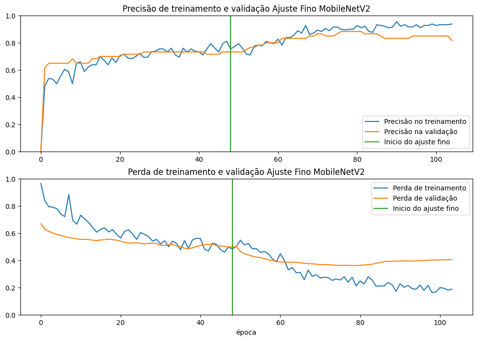
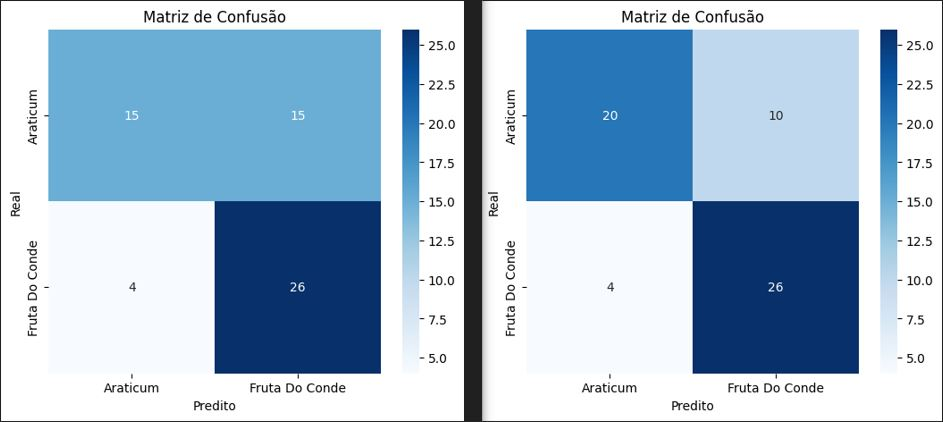
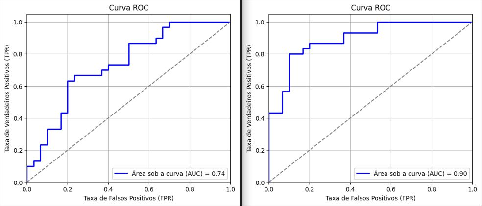
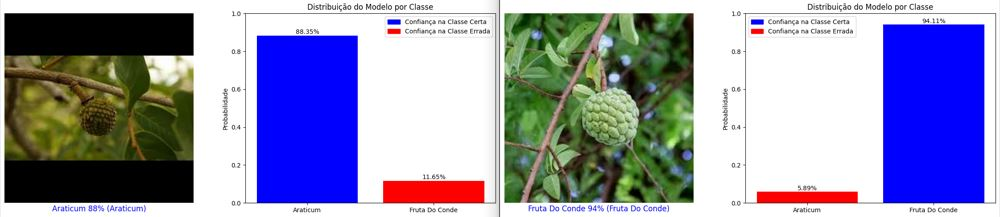
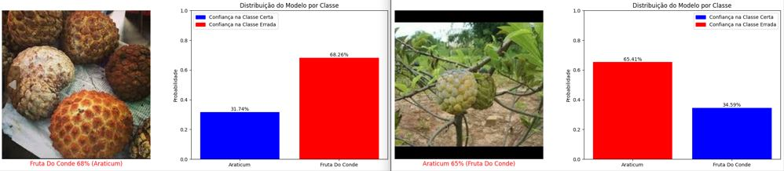

# Projeto: Classificacao de Frutas com Transfer Learning (MobileNetV2)

## 📌 Sobre o Projeto
Este projeto utiliza **Transfer Learning** com a arquitetura **MobileNetV2** para classificar imagens de frutas: **Araticum** e **Fruta do Conde**. O modelo é treinado com um dataset pequeno, usando técnicas de **aumento de dados** (Data Augmentation) e **ajuste fino** (Fine-Tuning) para melhorar a generalização.

## 📂 Estrutura do Projeto
```
Projeto_Transfer_Learning/
├── conjunto_dados/          # Contém os datasets de treino, validação e teste
│   ├── treino/
│   ├── validacao/
│   ├── teste/
|
├── img/                     # Imagens
├── modelos/                 # Diretório para salvar os modelos treinados
├── scripts/                 # Contém os scripts do projeto
├── README.md                # Documentação do projeto
```
O projeto está organizado nos seguintes módulos:

- `carregar.py`: Responsável pelo carregamento e pré-processamento das imagens.
- `chamadas.py`: Define os callbacks utilizados no treinamento do modelo.
- `constantes.py`: Contém definições como caminhos dos diretórios, hiperparâmetros e classes do modelo.
- `graficos.py`: Funções para visualização de métricas e resultados.
- `modelo.py`: Implementação do modelo MobileNetV2 e do ajuste fino.
- `main.py`: Script principal para execução do modelo.

## 🛠️ Tecnologias Utilizadas
- **TensorFlow / Keras**: Para construir e treinar a rede neural
- **MobileNetV2**: Modelo pré-treinado usado para Transfer Learning
- **tf.data.Dataset**: Para otimizar o carregamento das imagens
- **Matplotlib e Seaborn**: Para visualização dos resultados e análise
- **Scikit-learn**: Para cálculo da matriz de confusão
- **Python 3.8+**

## Conjunto de Dados
Uma pequena amostra do conjunto de dados.

<p>
<center>


</center>
</p>

## 🏋️ Treinamento do Modelo
O modelo foi treinado em duas etapas:

### 1. Treinamento do Modelo Base

Inicialmente, a MobileNetV2 foi utilizada como extratora de características, mantendo suas camadas convolucionais congeladas. Apenas o classificador foi treinado nesta fase.

**Conjuntos de Dados**
 - Treinamento: 180 imagens
 - Validação: 60 imagens
 - Teste: 60 imagens

**Desempenho do Modelo Base:**

Inicialmente, o modelo apresentou uma acurácia de 0.6833, com uma perda de 0.6260 no conjunto de teste. Esses valores indicam um desempenho moderado, mas ainda distante de uma classificação ideal.

A análise das métricas por classe revela um desbalanceamento na capacidade de reconhecimento entre as categorias:

 - **Araticum**, a precision foi de 0.79, mas o recall baixo (0.50) sugere que muitos exemplos dessa classe foram classificados incorretamente.
 - **Fruta do Conde**, a precision foi menor (0.63), mas o recall elevado (0.87) indica que a classe foi bem capturada, embora com maior incidência de falsos positivos.

O F1-Score, métrica que equilibra precision e recall, reflete essa disparidade: 0.61 para Araticum e 0.73 para Fruta do Conde. Além disso, a AUC de 0.74 na curva ROC confirma um desempenho razoável, mas com espaço para melhorias.

O modelo base apresenta um overfitting moderado, o que sugere que o ajuste pode ter ocorrido de forma limitada e que melhorias na regularização, aumento de dados ou ajustes nos hiperparâmetros poderiam ser benéficos.

### 2. Ajuste Fino (Fine-Tuning)

Após o primeiro treinamento, algumas camadas convolucionais da MobileNetV2 foram descongeladas e treinadas com uma taxa de aprendizado reduzida para melhor adaptação ao dataset.

**Resultados do ajuste fino:**

O ajuste fino resultou em melhorias expressivas:

 - A acurácia aumentou para 0.7667, indicando uma maior capacidade do modelo em realizar predições corretas.
 - A perda diminuiu para 0.5077, evidenciando um melhor ajuste aos dados de teste.
 - A AUC subiu para 0.90, sugerindo que o modelo aprimorado consegue distinguir melhor entre as classes.

Nas métricas de classificação por classe:

- **Araticum**: a precision subiu para 0.83 e o recall para 0.67, reduzindo os erros de classificação desta classe.
- **Fruta do Conde**: a precision aumentou para 0.72, enquanto o recall permaneceu alto em 0.87, indicando que o modelo manteve uma forte capacidade de identificação dessa classe.

A média macro das métricas também apresentou crescimento (precision: 0.78, recall: 0.77, F1-Score: 0.76), confirmando um equilíbrio geral aprimorado.

Entretanto, observa-se um aumento no overfitting, o que sugere que o modelo pode estar se ajustando excessivamente ao conjunto de treinamento. Esse fenômeno pode limitar sua generalização para novos dados, tornando necessária uma análise mais aprofundada das estratégias de regularização, como:

- Aumento do conjunto de dados, para reduzir a dependência de padrões específicos.
- Uso de técnicas de data augmentation, que podem gerar variações nas imagens sem adicionar novos exemplos reais.
- Regularização com dropout, caso já esteja sendo usado, pode ser ajustado para valores mais adequados.
- Fine-tuning mais controlado, talvez congelando mais camadas iniciais para evitar um aprendizado excessivamente específico do conjunto de treino.

<p>
<center>


</center>
</p>

**Matriz de Confusão:** O modelo demonstrou uma boa capacidade de diferenciação entre as classes, mas ainda apresenta dificuldades na classificação da classe Araticum.

<p>
<center>


</center>
</p>

**Curva ROC:** A área sob a curva (AUC) apresentou um valor próximo de **0.90**, após o ajuste fino indicando um bom desempenho geral.

<p>
<center>


</center>
</p>

## 📊 Visualização de exemplos classificados corretamente e incorretamente.

<p>
<center>



</center>
</p>


## 📌 Conclusão

O ajuste fino demonstrou uma melhora significativa na acurácia, precisão e capacidade de discriminação do modelo MobileNetV2 para a tarefa de classificação de Araticum e Fruta Do Conde. O ganho de AUC para 0.90 destaca uma evolução substancial na performance do modelo, tornando-o mais confiável para a aplicação desejada.

Contudo, o aumento do overfitting exige atenção. Estratégias para aumentar a robustez do modelo, como data augmentation e ajustes na regularização, podem ser consideradas para melhorar a generalização sem comprometer o desempenho.

De modo geral, os resultados indicam um avanço sólido, e com refinamentos adicionais, o modelo pode alcançar uma performance ainda mais consistente e confiável.

Este projeto pode ser expandido para classificar novas categorias de frutas ou ser integrado a sistemas de reconhecimento visual.

---

## 🔧 Como Executar o Projeto
### 1️⃣ Instalar as Dependências
```bash
pip install tensorflow matplotlib numpy seaborn scikit-learn
```

### 2️⃣ Configurar e Rodar o Treinamento
Execute o script principal para treinar o modelo:
```bash
python main.py
```
ou execulte o notebook `rodar_script_main.ipynb`

---
