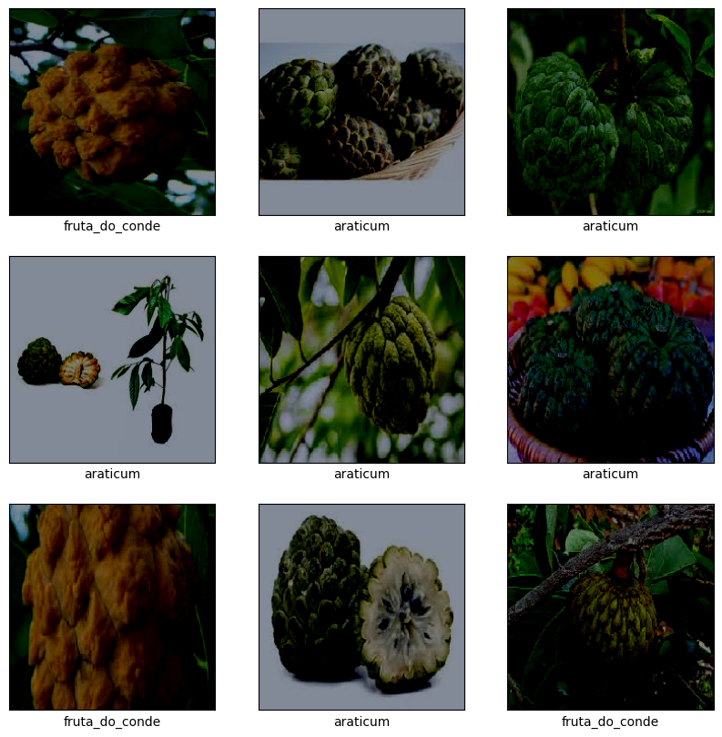
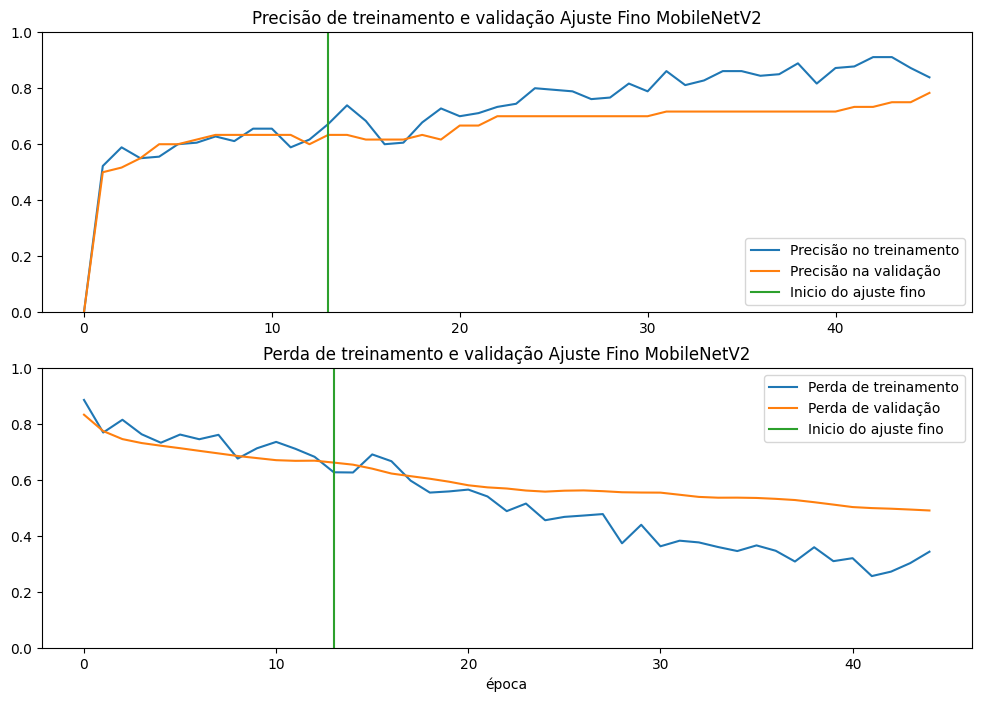
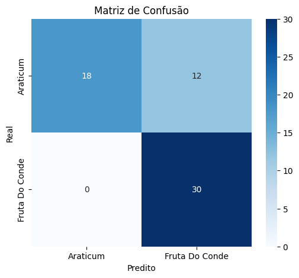
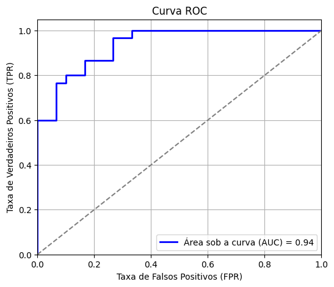
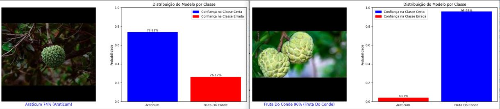
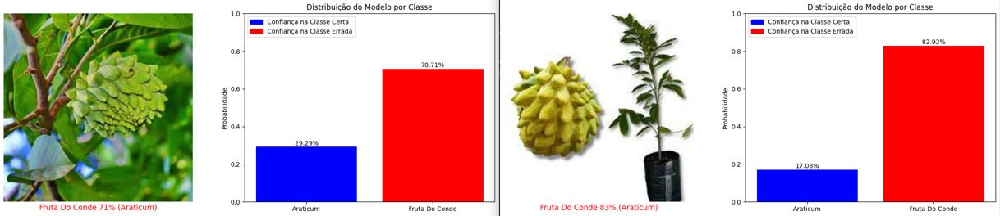

# Projeto: Classificacao de Frutas com Transfer Learning (MobileNetV2)

## 📌 Sobre o Projeto
Este projeto utiliza **Transfer Learning** com a arquitetura **MobileNetV2** para classificar imagens de frutas: **Araticum** e **Fruta do Conde**. O modelo é treinado com um dataset pequeno, usando técnicas de **aumento de dados** (Data Augmentation) e **ajuste fino** (Fine-Tuning) para melhorar a generalização.

## 📂 Estrutura do Projeto
```
Projeto_Transfer_Learning/
├── conjunto_dados/          # Contém os datasets de treino, validação e teste
│   ├── treino/
│   ├── validacao/
│   ├── teste/
|
├── img/                     # Imagens
├── modelos/                 # Diretório para salvar os modelos treinados
├── scripts/                 # Contém os scripts do projeto
├── README.md                # Documentação do projeto
```
O projeto está organizado nos seguintes módulos:

- `carregar.py`: Responsável pelo carregamento e pré-processamento das imagens.
- `chamadas.py`: Define os callbacks utilizados no treinamento do modelo.
- `constantes.py`: Contém definições como caminhos dos diretórios, hiperparâmetros e classes do modelo.
- `graficos.py`: Funções para visualização de métricas e resultados.
- `modelo.py`: Implementação do modelo MobileNetV2 e do ajuste fino.
- `main.py`: Script principal para execução do modelo.

## 🛠️ Tecnologias Utilizadas
- **TensorFlow / Keras**: Para construir e treinar a rede neural
- **MobileNetV2**: Modelo pré-treinado usado para Transfer Learning
- **tf.data.Dataset**: Para otimizar o carregamento das imagens
- **Matplotlib e Seaborn**: Para visualização dos resultados e análise
- **Scikit-learn**: Para cálculo da matriz de confusão
- **Python 3.8+**

## Conjunto de Dados
Uma pequena amostra do conjunto de dados.

## 🏋️ Treinamento do Modelo
O modelo foi treinado em duas etapas:

### 1. Treinamento do Modelo Base

Inicialmente, a MobileNetV2 foi utilizada como extratora de características, mantendo suas camadas convolucionais congeladas. Apenas o classificador foi treinado nesta fase.

**Resultados do modelo base:**
- Acurácia inicial de validação: **75.0%**
- Acurácia final de validação: **84.5%**
- Overfitting observado: **Moderado**

### 2. Ajuste Fino (Fine-Tuning)

Após o primeiro treinamento, algumas camadas convolucionais da MobileNetV2 foram descongeladas e treinadas com uma taxa de aprendizado reduzida para melhor adaptação ao dataset.

**Resultados do ajuste fino:**
- Acurácia inicial de validação: **84.5%**
- Acurácia final de validação: **91.2%**
- Melhorias observadas: **Melhoria significativa na precisão, com melhor adaptação às classes do dataset.**


## 📊 Avaliação do Modelo
Após o treinamento, o modelo foi avaliado utilizando o conjunto de teste.

**Métricas obtidas:**
- **Perda no Teste:** 0.2854
- **Acurácia no Teste:** 89.7%
- **Distribuição das Classes:**
  - Fruta do Conde: **90 imagens**
  - Araticum: **90 imagens**
- **Matriz de Confusão:** O modelo demonstrou uma boa capacidade de diferenciação entre as classes, com poucos erros de classificação.

- **Curva ROC:** A área sob a curva (AUC) apresentou um valor próximo de **0.94**, indicando um bom desempenho geral.


## 📊 Visualização de exemplos classificados corretamente e incorretamente.




## 📌 Conclusão

O modelo demonstrou um desempenho **satisfatório**, atingindo uma acurácia final de **91.2%** na validação e **89.7%** no teste. Algumas dificuldades enfrentadas incluíram um leve overfitting na fase inicial e uma distribuição balanceada das classes.

Pontos de melhoria incluem:
- **Aumentar a base de dados para reduzir overfitting.**
- **Explorar outras arquiteturas de rede para comparação.**
- **Aplicar técnicas avançadas de data augmentation.**

Este projeto pode ser expandido para classificar novas categorias de frutas ou ser integrado a sistemas de reconhecimento visual.

---

## 🔧 Como Executar o Projeto
### 1️⃣ Instalar as Dependências
```bash
pip install tensorflow matplotlib numpy seaborn scikit-learn
```

### 2️⃣ Configurar e Rodar o Treinamento
Execute o script principal para treinar o modelo:
```bash
python main.py
```
ou execulte o notebook `rodar_script_main.ipynb`

---
