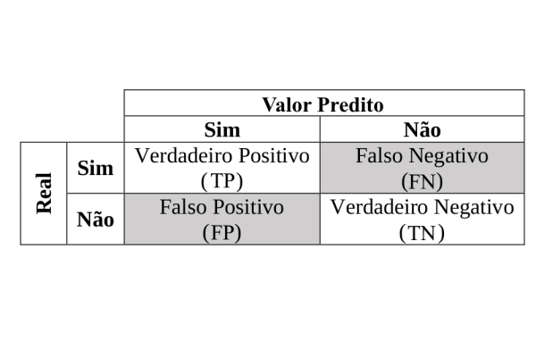

# Cálculo de Métricas de Avaliação de Aprendizado

---

# Descrição do Desafio
Cálculo de Métricas de Avaliação de Aprendizado

Neste projeto, vamos calcular as principais métricas para avaliação de modelos de classificação de dados, como acurácia, sensibilidade (recall), especificidade, precisão e F-score. Para que seja possível implementar estas funções, você deve utilizar os métodos e suas fórmulas correspondentes (Tabela 1).

Para a leitura dos valores de VP, VN, FP e FN, será necessário escolher uma matriz de confusão para a base dos cálculos. Essa matriz você pode escolher de forma arbitraria, pois nosso objetivo é entender como funciona cada métrica.

Tabela 1: Visão geral das métricas usadas para avaliar métodos de classificação. VP: verdadeiros positivos; FN: falsos negativos; FP: falsos positivos; VN: verdadeiros negativos; P: precisão; S: sensibilidade; N: total de elementos.

Matriz de confusão

