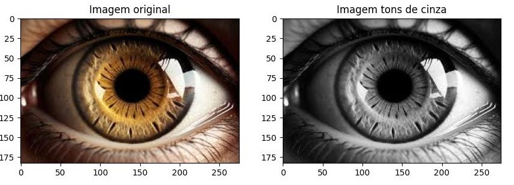
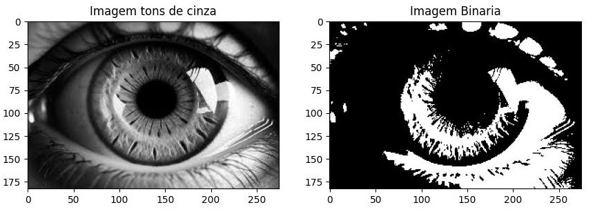
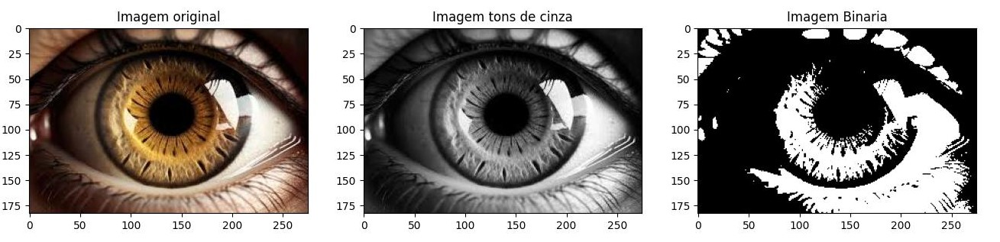
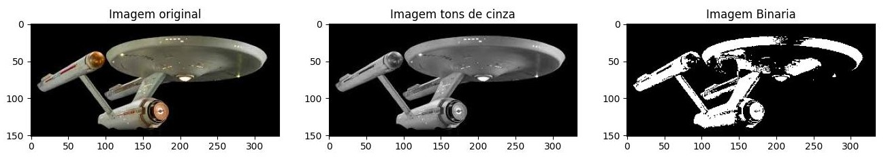
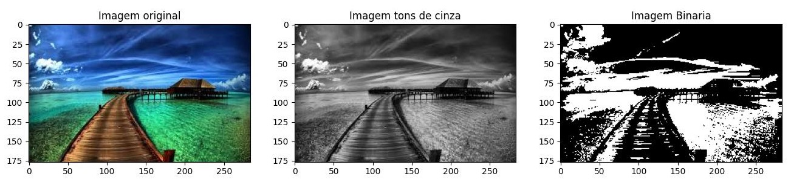
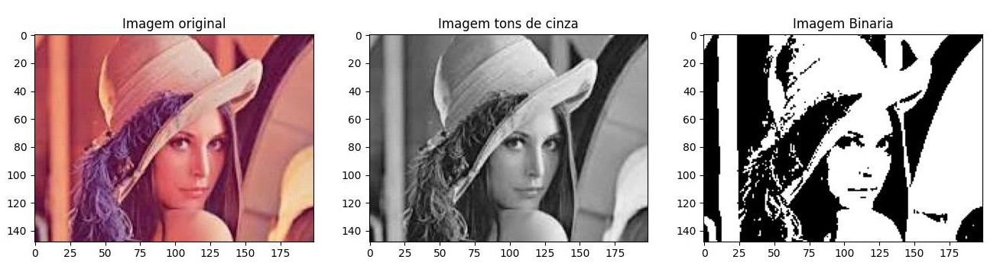
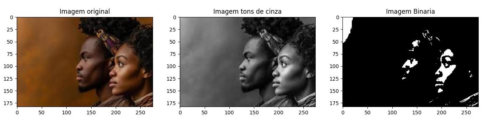

# Desafio de Projeto 2: Conversão de Imagens
##  RGB → Tons de Cinza → Preto e Branco

## Objetivo

O objetivo deste desafio é converter imagens coloridas para tons de cinza e, em seguida, converter a imagem em tons de cinza para uma imagem binária. Para isso, serão criadas funções específicas para realizar a conversão para tons de cinza e para binarizar a imagem.

## Funções Criadas

### Função 1: `binarizar`

Converte uma imagem em tons de cinza para uma imagem binária, utilizando um limiar.

#### Parâmetros:
- `img`: A imagem em tons de cinza (matriz de pixels).
- `limiar`: O valor de limiar para determinar o que é preto (0) e o que é branco (1). O valor padrão é 127.

#### Retorno:
- Uma imagem binária (matriz de pixels com valores 0 ou 1).

### Função 2: `plot_imagens`

Plota três imagens lado a lado para comparação: a imagem original, a imagem em tons de cinza e a imagem binarizada.

#### Parâmetros:
- `img`: A imagem original que será exibida no primeiro subgráfico.
- `cinza`: A imagem em tons de cinza que será exibida no segundo subgráfico.
- `binaria`: A imagem binária que será exibida no terceiro subgráfico.

#### Retorno:
- Não retorna nada, apenas exibe as imagens.

## Como Executar

1. Clone este repositório ou baixe os arquivos.
2. Certifique-se de ter as bibliotecas necessárias instaladas:
   - `numpy`
   - `matplotlib`

   Você pode instalar essas bibliotecas usando o seguinte comando:

   ```bash
   pip install numpy matplotlib
   ```
3. Organização das imagens

   As imagens originais que você deseja processar devem estar armazenadas em uma pasta chamada `img`. Essa pasta `img` deve estar localizada no mesmo diretório onde o seu arquivo de código (seja ele `.py` ou `.ipynb`) está. Ou seja, se o arquivo de código está na raiz do seu projeto, a pasta `img` também deve estar nessa mesma raiz.

## Exemplo de Estrutura de Diretórios:

```bash
/reduzir_dimensao
├── /img              # Pasta que contém as imagens originais
│   ├─ imagem1.jpg
│   ├─ imagem2.jpg
│   ├─ imagem3.jpg
│   ├─ imagem4.jpg
│   └─ imagem5.jpg
├─ reducao.py     # Arquivo Python
└─ README.md
```

## Análise da Saída

A seguir, vamos observar o que acontece nas imagens após o processo de conversão para tons de cinza e binarização.

### 1. **Imagem original → Tons de cinza**

A primeira transformação realizada é a conversão da imagem colorida (RGB) para tons de cinza. Isso é feito aplicando um coeficiente ponderado sobre os canais de cor (vermelho, verde e azul) da imagem. A [fórmula](https://en.wikipedia.org/wiki/Grayscale#:~:text=For%20the%20common,%5B6%5D) utilizada é a seguinte:

```python
  img_cinza = (0.2126 * vermelho + 0.7152 * verde + 0.0722 * azul)
```

#### Exemplo de saída:


### 2. **Imagem em tons de cinza → Binarização**

Após a conversão para tons de cinza, o próximo passo é binarizar a imagem. Isso significa transformar a imagem em uma matriz onde cada pixel é 0 (preto) ou 1 (branco), dependendo de um limiar (threshold) definido. Nesse caso, foi utilizado o valor padrão de 127.

- Como funciona a binarização:

    - Para cada pixel na imagem em tons de cinza, a função `binarizar` compara o valor de brilho com o limiar de 127:
        - Se o valor do pixel for menor que 127, ele é convertido para 0 (preto).
        - Se o valor do pixel for maior ou igual a 127, ele é convertido para 1 (branco).

#### Exemplo de saída:


## Saída Final

### Olho humano


### Star Trek: Enterprise


### Paisagem


### Lena


### Modelo

