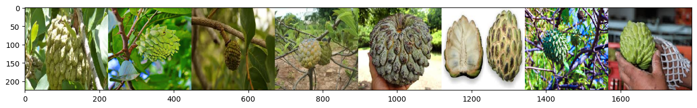
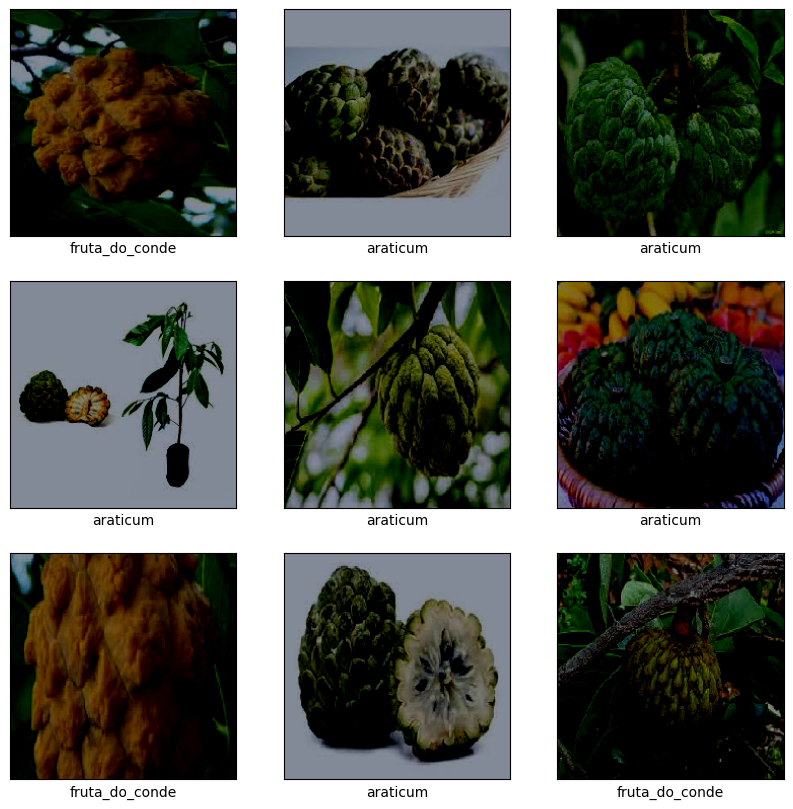
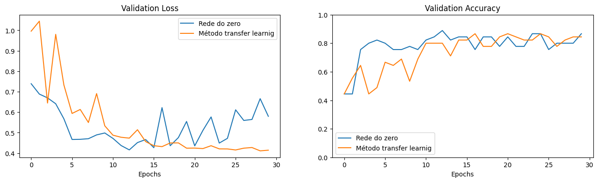
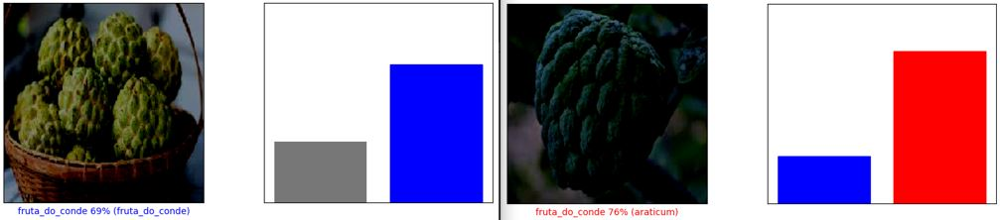

# Classificação de Frutas da familia [Annonaceae](https://pt.wikipedia.org/wiki/Annonaceae) Utilizando Transfer Learning com Deep Learning

Este projeto utiliza Transfer Learning para classificar imagens de frutas em duas categorias: **fruta do conde** e **araticum**. A implementação foi realizada em Python no ambiente Google Colab, usando uma pequena base de dados própria com 150 imagens para cada classe.

## 📋 Descrição

Transfer Learning é uma técnica poderosa no campo de Deep Learning que permite utilizar modelos pré-treinados em grandes bases de dados para resolver problemas específicos com menos dados e tempo de treinamento. Este projeto exemplifica como aplicar este método para classificação de imagens.

## 🚀 Tecnologias e Ferramentas Utilizadas

- **Linguagem**: Python
- **Ambiente de Desenvolvimento**: Google Colab
- **Bibliotecas Principais**:
  - TensorFlow/Keras
  - NumPy
  - Matplotlib

- **Base de Dados**: Imagens próprias de frutas (fruta do conde e araticum).

## 📂 Estrutura do Projeto

- `transfer-learning.ipynb`: Código-fonte principal para treinar e avaliar o modelo.
- `Annonaceae/`: Diretório que contém um arquivo `.zip` com as imagens organizadas em subpastas, sendo cada subpasta correspondente a uma classe.
- `images`: Imagens usadas para o treinamento.
- `README.md`: Documentação do projeto.

## 📊 Base de Dados

A base de dados contém:
- **150 imagens da fruta do conde**
- **150 imagens do araticum**

As imagens foram organizadas em duas pastas:

    Annonaceae/
            ├── fruta_do_conde/
            ├── araticum/

## 🔧 Etapas do Projeto

1. **Pré-processamento dos Dados**:
   - Redimensionamento das imagens.
   - Normalização dos pixels.
   - Divisão dos dados em conjuntos de treino, validação e teste.

2. **Configuração do Modelo**:
   - Utilização de um modelo pré-treinado (por exemplo, MobileNet, ResNet, ou VGG).
   - Ajuste da última camada para classificação binária.

3. **Treinamento e Validação**:
   - Treinamento do modelo com dados processados.
   - Avaliação do desempenho com métricas como precisão e perda.

4. **Teste e Visualização dos Resultados**:
   - Teste do modelo em imagens não vistas.
   - Visualização de exemplos classificados corretamente e incorretamente.

## 🖼️ Exemplos de Resultados

Observe que, embora o primeiro modelo (linha azul) tenha começado a mostrar sinais de estabilidade e uma leve oscilação na perda de validação após cerca de 15 épocas, o segundo modelo (linha laranja) apresenta um comportamento de aprendizagem mais consistente. O segundo modelo continuou a reduzir a perda de validação ao longo do tempo, indicando um ajuste mais eficaz aos dados, mesmo após o mesmo número de épocas.

## 📊 Visualização de exemplos classificados corretamente e incorretamente.

